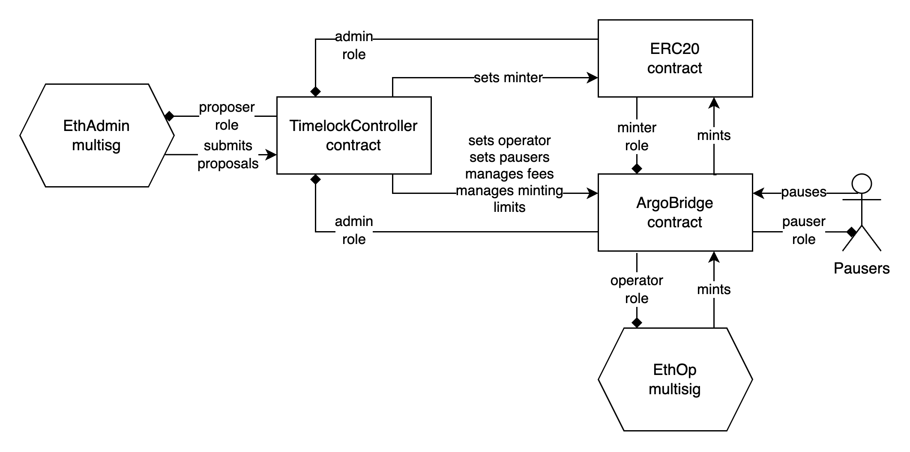
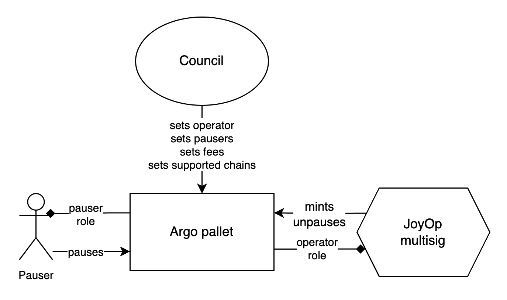
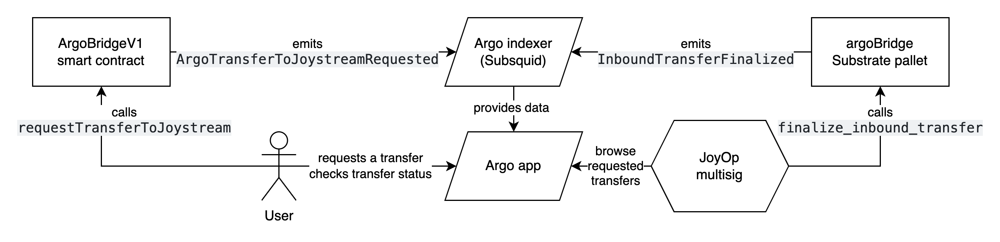
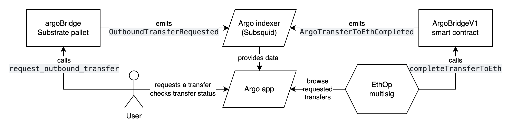

# Argo bridge architecture

Argo is an official, DAO-operated bridge between Joystream and Base chains, allowing transfer of JOY tokens between both chains. This document goal is to outline governance structure and operations of the bridge, on both sides of the bridge.

## Actors

- Council - ultimate owner of the bridge, responsible for management on both Joystream and Ethereum sides.
- EthAdmin - administrative multisig on Ethereum side. It would only take actions on council's request.
- EthOp - operational multsig on Ethereum side. It's responsible for all bridge operations on Ethereum side, mostly minting new tokens.
- JoyOp - operational multsig on Joystream side. Like EthOp, it would be responsible for minting new tokens on Joystream side.
- EthPausers - individuals with permission to single-handedly pause the bridge on Base side in case of an emergency.
- JoyPausers - same as EthPausers, just on Joystream side.

## EVM deployment

The Joystream EVM deployment consists of 3 smart contracts:

1. JoystreamERC20 - ERC20 JOY token (packages/contracts/contracts/JoystreamERC20.sol)
2. ArgoBridgeV1 - bridge smart contract for managing transfers (packages/contracts/contracts/ArgoBridgeV1.sol)
3. TimelockController - security proposal mechanism that requires all actions to go through grace period (https://github.com/OpenZeppelin/openzeppelin-contracts/blob/659f3063f82422cef820de746444e6f6cba6ca7c/contracts/governance/TimelockController.sol)

TimelockController is the sole admin of both JoystreamERC20 and ArgoBridgeV1, with EthAdmin being the sole proposer for the timelock.

You can see the full EVM governance flow below:

### Fees

All bridging requests from EVM chains need to pay a small fee in ETH associated with the request. All the ETH fees are kept in the ArgoBridgeV1 contract and can be withdrawn by EthAdmin through the timelock.

## Joystream deployment

The Joystream deployment is the `argoBridge` Substrate pallet, which can be found [in the Joystream monorepo](https://github.com/Joystream/joystream/tree/master/runtime-modules/argo-bridge). You can find more information about the pallet design [in this issue](https://github.com/Joystream/joystream/issues/5134). Here is the full Joystream governance flow:

### Fees

All bridging requests from Joystream need to pay a small fee in JOY associated with the request. All the JOY fees are burnt on request.

## Transfer flow

This is how the JOY->EVM transfer flow looks like:

And EVM->JOY:

## Security

The bridge deploys a number of security mechanisms to make sure it's as safe as possible and still usable.

### EVM timelock

As mentioned in the EVM deployment section, none of the multisigs are direct administrators of any contracts. Instead, the TimelockController is the admin of all the contracts. This requires for any changes to go through a grace period of few days. In the unlikely case of a malicious proposal, the delay can give the community time to react and cancel the proposal. In the worst case, if it's not possible to cancel the proposal, the grace period can give the bridge users time to withdraw their funds back to Joystream.

### EVM minting limits

The ArgoBridgeV1 contract has an adjustable minting limit. It specifies how many tokens can be minted in a given number of blocks. This ensures that even if the JoyOp multisig is compromised, the impact of the attack is limited. EthAdmin can adjust both the token limit and period length through the timelock.

### Joystream minting limits

The argoBridge pallet ensures that it can never mint more tokens than were already burned through the bridge. This ensures that the bridge pallet can never be used to increase the total supply of JOY tokens.

### Pausing

Both ArgoBridgeV1 and argoBridge pallet have a pause functionality that can be triggered by any of EthPausers or JoyPausers respectively. This ensures that the bridge can be quickly paused in case of an emergency, not allowing any new transfers to be requested or finalized. The unpausing on EVM side can only be done by EthAdmin, while the unpausing on Joystream side can only be done by JoyOp.
